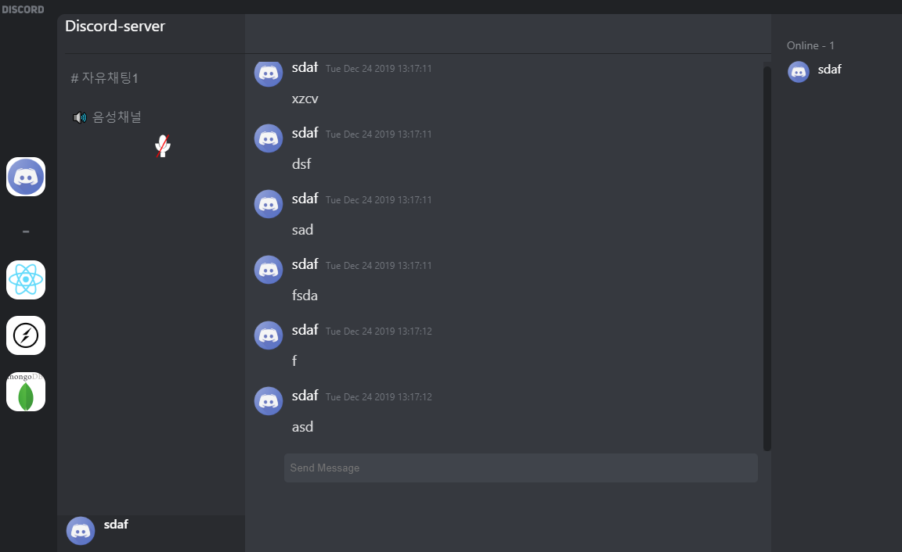

This project was bootstrapped with [Create React App](https://github.com/facebook/create-react-app).

Discord Clone using ReactJS, Electron, Socket.io and MongoDB



## server

```
~# cd server
~/server# yarn start
```

## client

`~# yarn start`

## Build

`~# yarn run dist`

Builds the app for electron production to the `dist` folder.<br />

## Todo

- [ ] real-time voice communication
- [ ] Make Channel
- [ ] Load Chats over scroll
